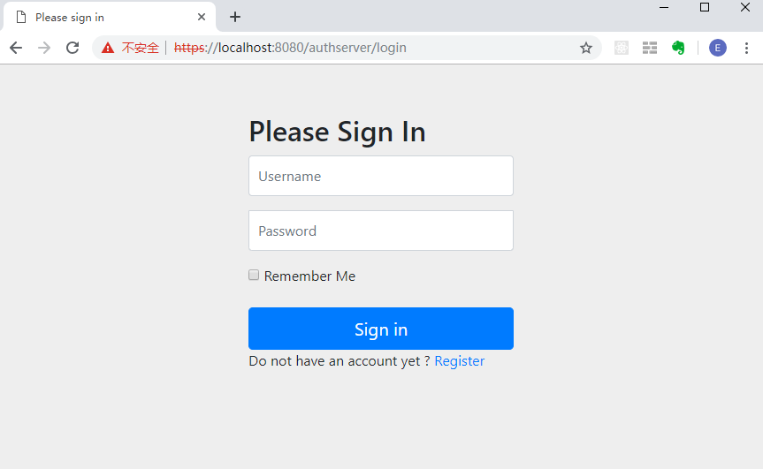
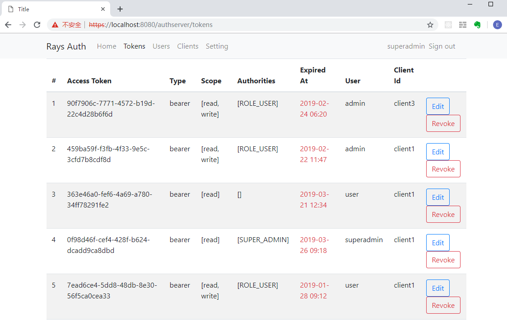

# OAuth Server 

An Authentication & Authorization Server which is based on Spring Security OAuth2.

授权与认证中心服务

## Quick Start

Requirements
- JDK 8
- Maven
- MySQL
- Redis

before you start this project, you should create a schema which is named `evan_sso`, then you can create tables by executing `evan_sso.sql`

Open with IDEA and run start `Auth`

`https://localhost:8080/authserver`

Login Page

Home

## 总体架构图(Architecture)

## API

接口名称(URL) | HTTP方法 | 说明 
-------- | -------- | -------- 
/oauth/token | | 获取访问令牌  (the token endpoint)
/oauth/authorize | | 授权 (the authorization endpoint)
/oauth/check_token | |校验Token  (used by Resource Servers to decode access tokens)
/oauth/token_key | |获取 JWT token

## 页面(Pages)

路由 | HTTP方法 | 说明 
-------- | -------- | -------- 
/oauth/confirm_access |GET |确认访问 approval (user posts approval for grants here)
/oauth/error |GET | 失败的页面 (used to render errors in the authorization server)

## 模块(Modules)

序号 | 接口 | 方法 | 说明 | 备注
---  | ---  | ---  | ---  | ----
1  | /oauth/token | POST | 获取访问令牌 | 
2  | /oauth/authorize | GET | 授权 | 
3  | /oauth/check_token | GET/POST | 校验Token，获取token信息 | 
4  | /rest/access-tokens | GET | 获取所有访问令牌 | 
5  | /rest/revoke-token/{token} | POST | 吊销访问令牌 | 
6  | /rest/revoke-refresh-token/{token} | POST | 吊销刷新令牌 | 
7  | /rest/clients/{client_id} | GET/DELETE/PUT | 查询，删除，修改客户端 | 
8  | /rest/clients | POST | 创建客户端 | 
9  | /rest/users/{username} | GET/DELETE/PUT | 查询，删除，修改用户 | 
10  | /rest/users | POST | 创建用户 | 

## Todo list

- Token缓存 :heavy_check_mark:
- 登录人机验证
- 日志记录 :heavy_check_mark:
- 支持JWT :heavy_check_mark:
- 管理员权限  :heavy_check_mark:
- 登录监控、IP统计(时间、次数) :heavy_check_mark:
- XSS（Cross-site Script) 跨站脚本攻击防护
- 注册用户名检测、用户输入校验
- https :heavy_check_mark:  
- http/2 :heavy_check_mark: (JDK 9+, or JDK 8 + tomcat native)
- 提供单页面登录功能
- 提供用户图片avatar
- 支持client根据jwt解析用户信息

## Reference

[1] http://projects.spring.io/spring-security-oauth/docs/oauth2.html

[2] https://spring.io/guides/tutorials/spring-boot-oauth2/#_social_login_manual

[3] https://developers.google.com/recaptcha/docs/v3

[4] https://www.thymeleaf.org/doc/articles/springsecurity.html

[5] https://www.concretepage.com/spring-boot/spring-boot-redis-cache

[6] https://docs.spring.io/spring-data/data-redis/docs/current/reference/html

[7] https://www.callicoder.com/configuring-spring-boot-application/

[8] https://docs.spring.io/spring-boot/docs/current/reference/html/howto-embedded-web-servers.html#howto-configure-http2-tomcat

[9] https://spring.io/guides/gs/spring-boot-docker/
